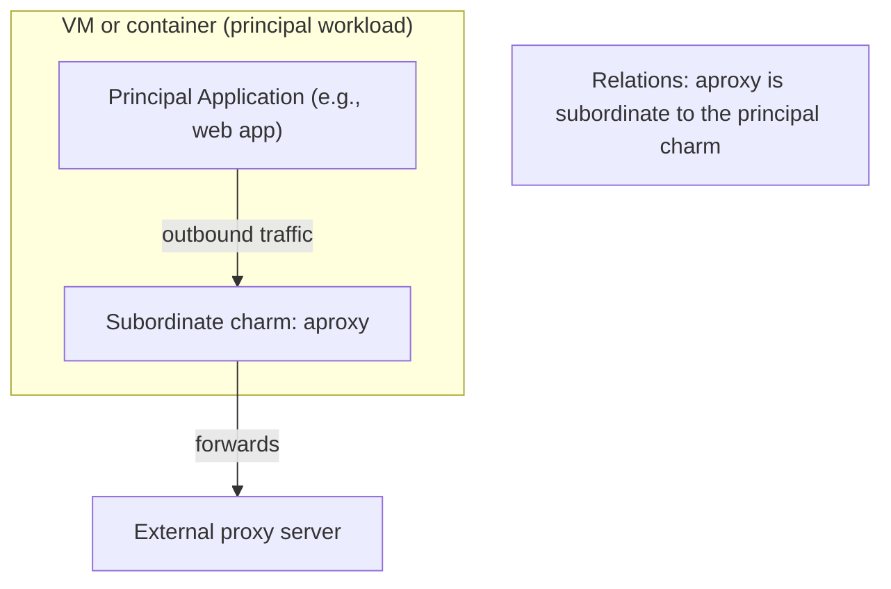
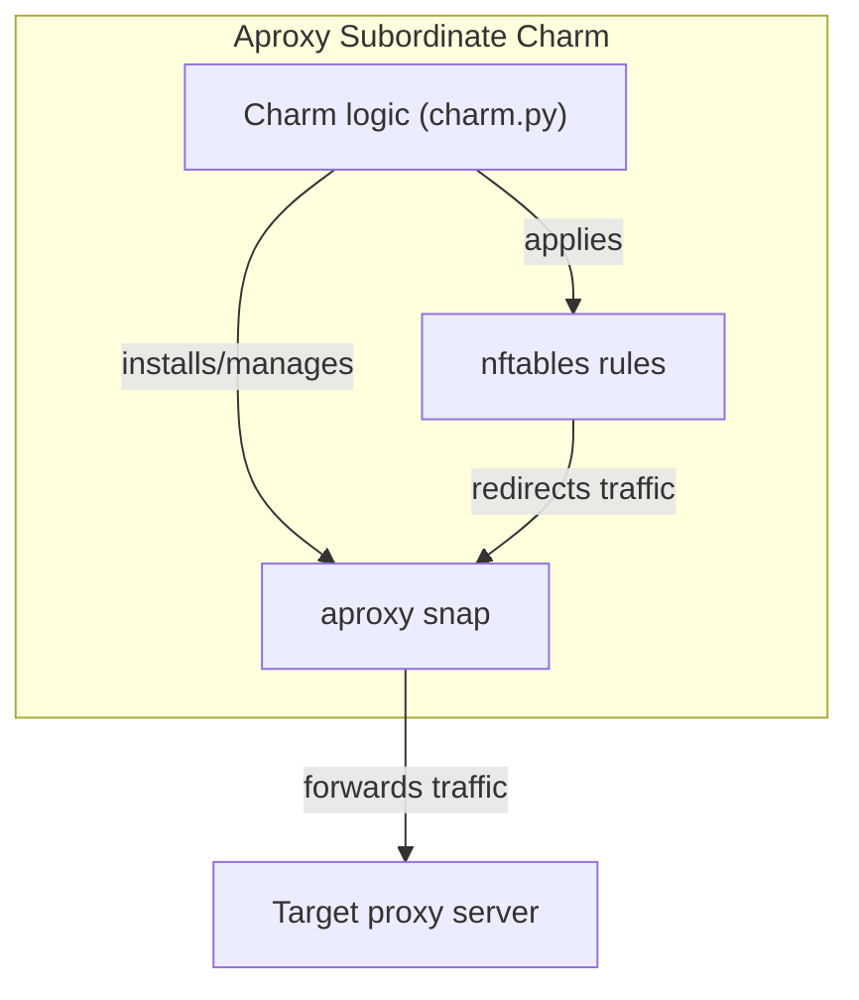

# Charm architecture

At its core, the aproxy subordinate charm installs and manages the aproxy snap, configures it to forward intercepted HTTP/HTTPS traffic to a target proxy, and manages nftables rules to transparently redirect outbound traffic through aproxy.

The charm design is subordinate, meaning it attaches to a principal application (such as a workload needing controlled egress traffic). Unlike a sidecar charm, this subordinate runs directly on the same machine as the principal charm. It does not use Pebble or sidecar containers, because it manages system-level services (snap and nftables) instead of container workloads.

The charm relies on:

- Snap service management for the aproxy snap.
- nftables rules dynamically configured by the charm to enforce transparent proxying.

As a result, if you run `juju status` in a model where the aproxy charm is deployed, you’ll see something like:

```bash
Unit          Workload  Agent  Machine  Public address  Ports  Message
aproxy/0*     active    idle   0        10.0.0.5               Aproxy interception service started.
```

This shows that aproxy runs on the same unit as the principal charm.

## High-level overview of aproxy deployment

The following diagram shows a typical deployment of the aproxy subordinate charm:



- The principal application generates outbound HTTP/HTTPS traffic.

- The aproxy subordinate charm intercepts this traffic via nftables and routes it through the aproxy snap.

- The traffic is forwarded to an external target proxy server (configured via proxy-address).

## Charm architecture

The following diagram shows the architecture of the aproxy charm:



- The charm code (`charm.py`) observes Juju lifecycle events and configures both snap and nftables.

- The aproxy snap provides the actual proxy functionality, listening on `127.0.0.1:8443`.

- nftables rules transparently intercept outbound traffic on configured ports and redirect it to the snap.

### Containers

This subordinate charm does not use containers or Pebble-managed processes. Instead, it directly manages system resources (snap and nftables) on the host machine.

## Metrics

To be added in the future.
<!--
If the charm uses metrics, include a list under reference/metrics.md and link that document here.
If the charm uses containers, you may include text here like:

Inside the above mentioned containers, additional Pebble layers are defined in order to provide metrics.
See [metrics](link-to-metrics-document) for more information.
-->

## Juju events

The charm observes the following Juju events:

- `install`: Installs the aproxy snap.

- `start`: Configures nftables rules and ensures interception is running.

- `config-changed`: Reapplies configuration (proxy address, no-proxy list, intercepted ports).

- `stop`: Cleans up nftables rules and removes the snap.

> See more in the Juju docs: [Hook](https://documentation.ubuntu.com/juju/latest/user/reference/hook/)

## Charm code overview

The `src/charm.py` is the default entry point for a charm and has the AproxyCharm Python class which inherits
from CharmBase. CharmBase is the base class from which all charms are formed, defined
by [Ops](https://ops.readthedocs.io/en/latest/index.html) (Python framework for developing charms).

> See more in the Juju docs: [Charm](https://documentation.ubuntu.com/juju/latest/user/reference/charm/)

The `__init__` method observes relevant Juju events and dispatches them to private handler methods:

- `_on_install` → installs snap.

- `_on_start` → applies nftables rules if configuration is valid.

- `_on_config_changed` → updates snap configuration and nftables.

- `_on_stop` → removes snap and nftables rules.

For example, when a configuration changes:

1. User runs:

```bash
juju config aproxy proxy-address=my-proxy.local
```

2. A config-changed event is emitted.

3. The charm observes it:

```python
self.framework.observe(self.on.config_changed, self._on_config_changed)
```

4. `_on_config_changed` validates the config, sets snap options, and reapplies nftables rules.
